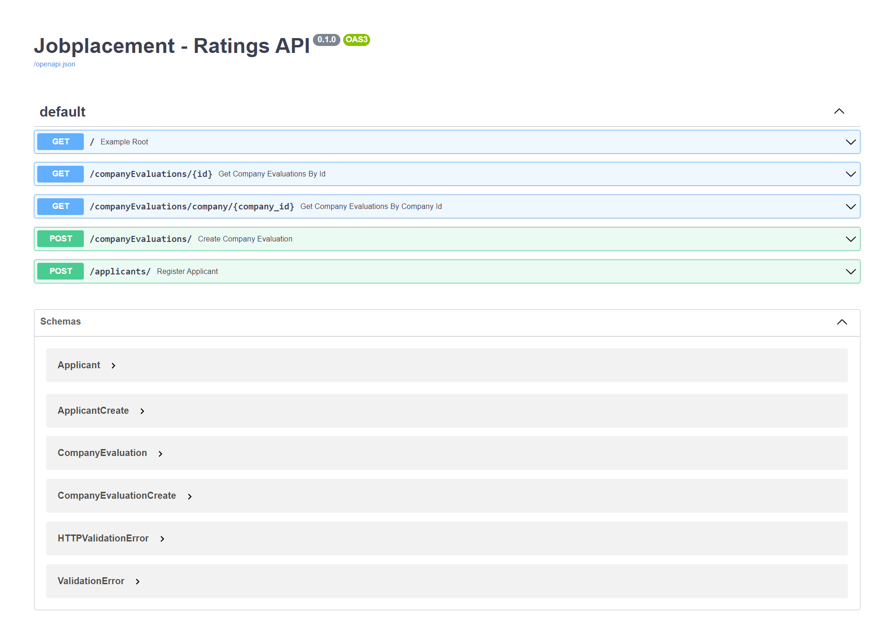

# Gethired Jobplacement Ratings Backend

🌠 Backend repository for the job placement cell in which we will perform the business logic of the defined Ratings squad.
## 🚀Getting Started

The application is built with this stack:
- [Docker](https://www.docker.com/) 🐋
- [Python](https://www.python.org/) 🐍
- [FastAPI](https://fastapi.tiangolo.com/) 🚀
- [Pydantic ](https://pydantic-docs.helpmanual.io/) 💯
- [PostgreSQL](https://www.postgresql.org/) 🐘
- [SQLAlchemy](https://www.sqlalchemy.org/) ⚙️

To get started you just need to download docker on your machine, I leave the link right here. ➡️ [Docker](https://www.docker.com/get-started "Docker").

## 🧑‍💻 Database access configuration using the .env file
1. First, Create in the root folder of the project a file named `.env` 📂.
2. Now configure your `.env` with this environment variables with the local credentials of the project below. ⬇️.

```
DB_CONNECTION=postgresql
DB_USERNAME=postgres
DB_PASSWORD=postgres
DB_HOST=postgresql
DB_DATABASE=jobplacement-ratings
DB_PORT=5432
```

## 🐳 Run the Project with Docker
You can run the following command to buil the image.

```
 $ docker-compose build
```

Once the image is built, run the container:
```
$ docker-compose up -d
```

If you want to be faster in launching the project you can use the following command to perform the above two steps in one. 

```
$ docker-compose up --build
```
## 📑 Interactive API docs 

Now go to http://127.0.0.1:8000/docs.

You will see the automatic interactive API documentation (provided by Swagger UI).

